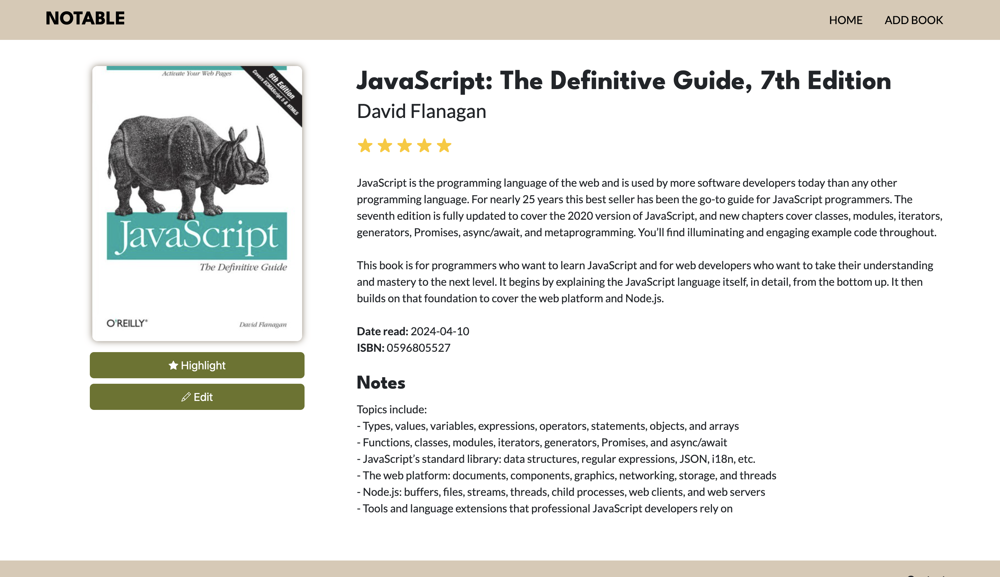

# Notable

Book notes web app useful for saving read books and adding memorable notes along the way.

The app allows the user to view all saved books, sort them by recency, rating or title. The user can add new books, edit content on previously added books or removing them. The landing page features a "Highlight" section that showcases the most memorable book in the library.

## Requirements

For development, you will only need Node.js and a node global package, Yarn, installed in your environement.

## Setup
Use `npm i` to initialize the project.

Run the project using `node index.js`.

Server running on port `http://localhost:3000/`.

## Development process
1. Prototyping (database and CRUD functionality)
2. Design
3. Implementation: desktop, mobile
4. Testing
5. Update Documentation
6. Deployment

## Design document
See design document [here](docs/design/notable-design-doc.pdf).

## CRUD Functionality (PostgreSQL)
Books table schema


### Create
```
await db.query(`
	INSERT INTO books (title, author, isbn, short_description, notes, rating, date_read)
	VALUES ($1, $2, $3, $4, $5, $6, $7)
	RETURNING id;
`,
[title, author, isbn, new_short_description || null, new_notes || null, parseInt(rating) || null, new Date(date_read).toISOString().slice(0, 10)]);
```

### Read

Fetching all data sorted by title, date read or rating:
`await db.query("SELECT * FROM books ORDER BY title ASC");`

`await db.query("SELECT * FROM books ORDER BY date_read DESC");`

`await db.query("SELECT * FROM books ORDER BY rating DESC);`


Fetching specific data by id:
`await db.query("SELECT * FROM books WHERE id = $1", [id]);`

### Update

Update data with id:

```
await db.query(`
	UPDATE books
	SET title=$1, author=$2, isbn=$3, short_description=$4, notes=$5, rating=$6, date_read=$7
	WHERE id = $8;`,
	[title, author, isbn, short_description, notes, rating, new Date(date_read).toISOString().slice(0, 10), id]
);
```

### Delete

```
await db.query("DELETE FROM books WHERE id = $1", [id]);
```

## API - OpenLibrary Cover
See documentation [here](https://openlibrary.org/dev/docs/api/covers).

## Test plan
See test plan [here](docs/test_plan/test_plan.md).

## Further improvements
- Scalability: allow users to log in and manage their book lists. Allow sharing the list with other users.
- Tweaks: attach highlight to user account.

## Screenshots

### Desktop





### Mobile


